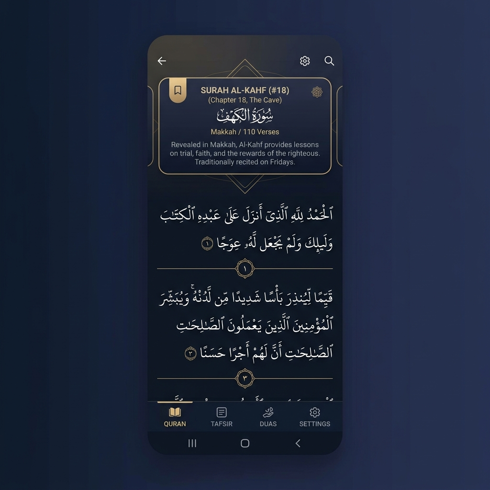
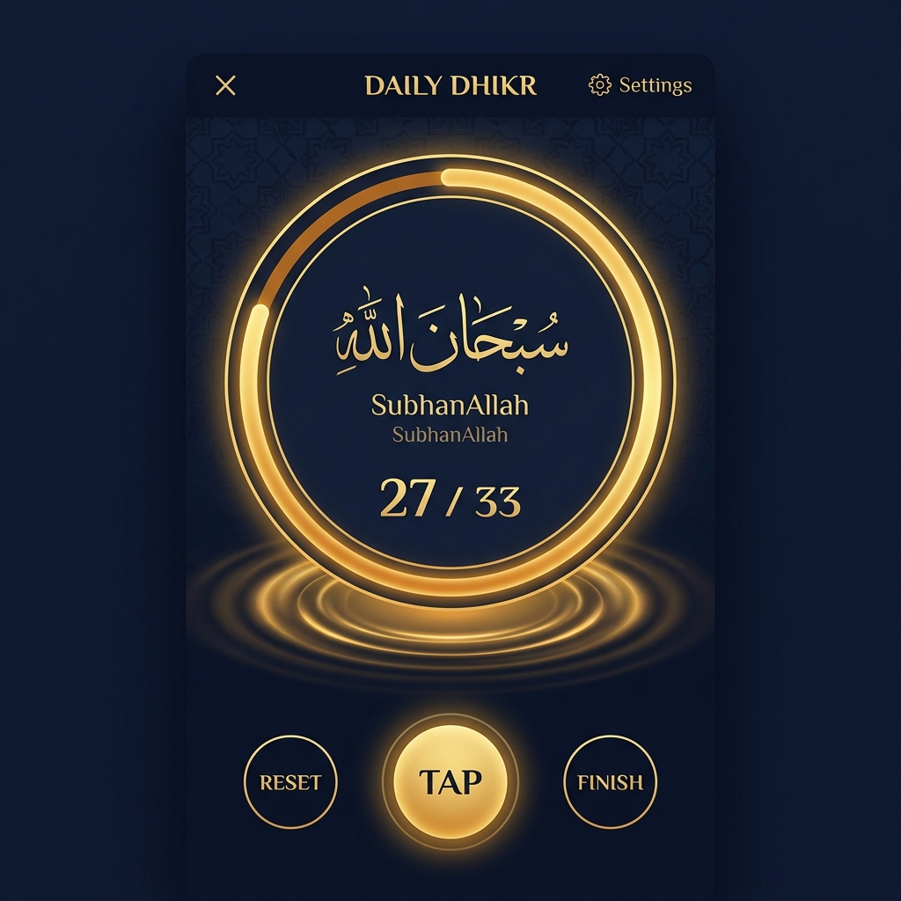
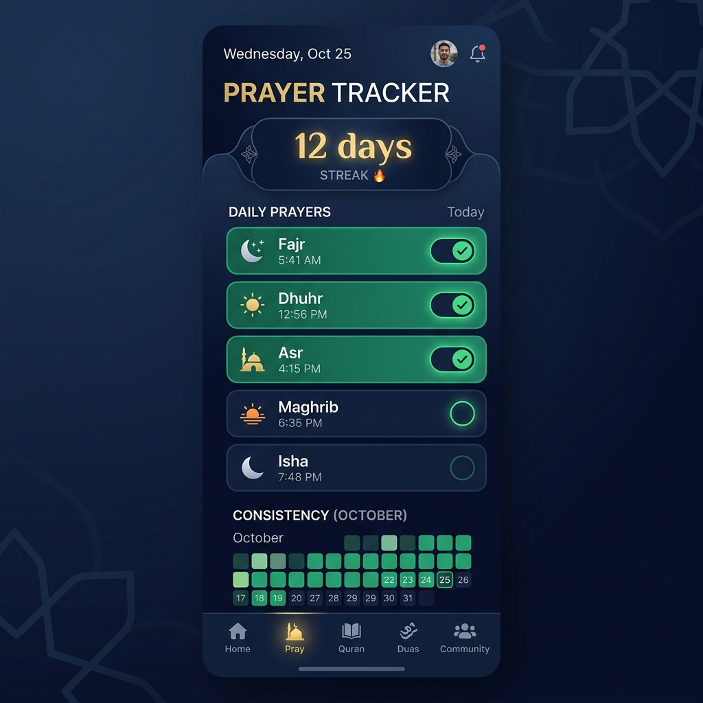
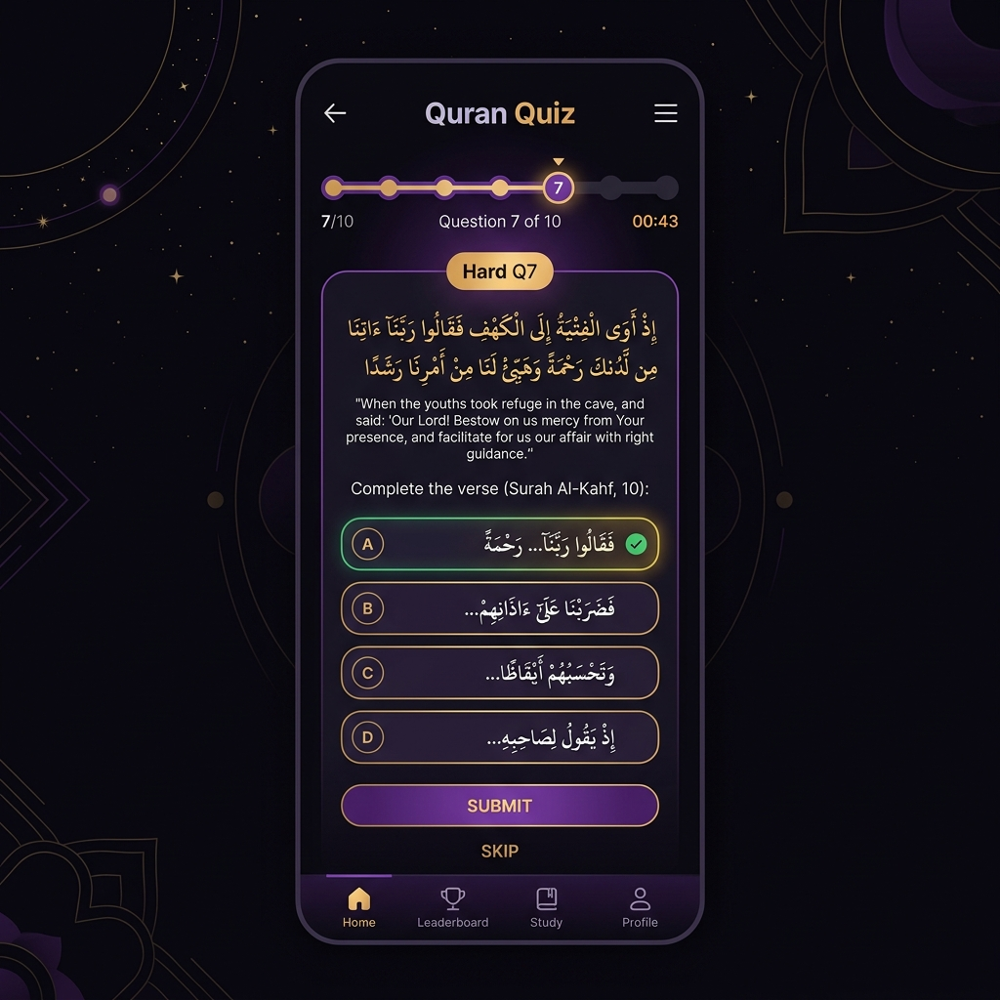
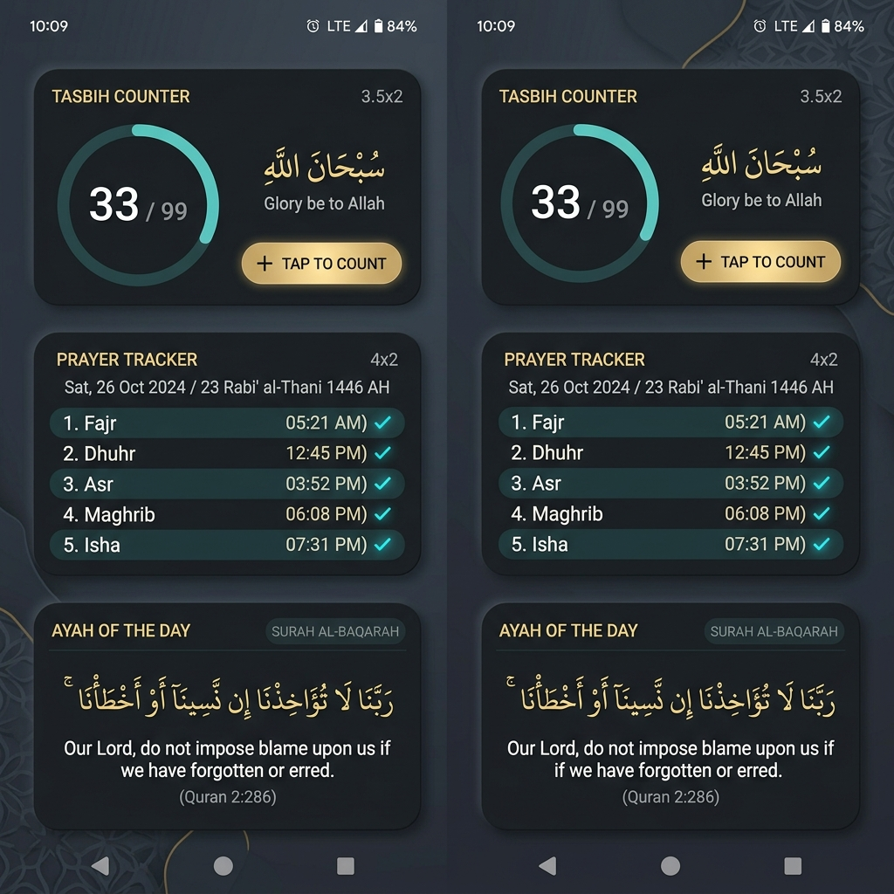

<div align="center">

# بِسْمِ ٱللَّٰهِ ٱلرَّحْمَٰنِ ٱلرَّحِيمِ

---

# Dhikr  ذِكْر

**A distraction-free spiritual companion for Android.**

[](https://dhikr.contentify.studio)
&nbsp;
[](https://dhikr.contentify.studio)
&nbsp;
[](https://dhikr.contentify.studio)

</div>

---

## You know that feeling?

You open your phone to read some Quran. Then somehow you're 20 minutes deep into a YouTube rabbit hole about cats.

Yeah. Same.

That's the exact problem Dhikr was built to solve. No ads. No notification spam. No social feed. Just your Quran, your dhikr, your prayers and a bunch of home screen widgets that keep you connected without even opening the app.

Everything lives on your phone. Nothing's sent anywhere. No account needed.

---

<div align="center">


*The Quran reader. You can switch between Uthmani and IndoPak scripts on the fly.*

</div>

---

## What's in the app?

### Read Quran the way it's meant to be read

You get two scripts  Uthmani and IndoPak. Switch between them whenever you want, even mid-session. Both translations (English and Urdu by Ahmed Raza Khan) show up together, so you're not flipping back and forth between screens.

Every Surah comes with a history card. Makki or Madani? What was happening when it was revealed? What's the central theme? It's all there  not as a Wikipedia dump, but as a short, readable note that gives the Surah context before you read it.

Bookmarks go into folders you name yourself. And one folder can be set as your "primary"  that's the one that feeds your home screen widgets. Your Last Read widget, your Juz Progress widget  they all track whatever's in your primary folder.

---

### Count your dhikr (and have it on your home screen too)

<div align="center">


*The Tasbih counter  haptic feedback on every tap, progress ring fills as you go.*

</div>

Pick any dhikr. Set a target  33, 99, 100, or just go unlimited. Tap to count. Your phone buzzes slightly with each tap (you can turn that off if it's not your thing).

Here's the part that took the most work to build: the counter is **live-synced with your home screen widget**. Tap the widget counter, the in-app number goes up. Tap in the app, the widget updates. No delay, no refresh button, no "close and reopen to sync." It just works.

When you hit your target, you get a different vibration. You know you're done.

---

### Track your prayers without a spreadsheet

Five prayers a day. A checkbox for each. A streak counter that makes you feel genuinely bad about breaking it (in the best way).

There's also a Sajdah al-Tilawah tracker  all 15 prostrations of recitation, each one listed with its exact verse and Surah. It sounds niche, but if you're doing Quran recitation seriously, you've probably lost track of which ones you've done. This fixes that.

---

<div align="center">


*Prayer tracker with streak counter. That 12-day streak hits different when you almost broke it.*

</div>

---

### A Quran quiz that actually teaches you something

This one's different from those "tap the right translation" quizzes. You pick a Surah and Ayah range, and the app generates a 10-question quiz using Groq's AI.

The questions are split by difficulty on purpose: 3 easy ones (broad moral lessons), 3 medium (theology and history), and 4 hard questions that go into Asbab al-Nuzul  the circumstances of revelation  and Aqeedah. The kind of stuff that trips you up even if you've read that Surah a hundred times.

The system prompt is written to align strictly with the creed of the Ahl-e-Sunnat wal Jama'at. The explanations after each answer aren't just "correct/wrong"  they're short tafsir-style notes. You actually learn something.

---

<div align="center">


*A quiz question mid-session. Difficulty badge, verse reference, four options. The "Hard" questions are genuinely hard.*

</div>

---

### 15 home screen widgets

<div align="center">


*A few of the 15 widgets. Ayah of the Day, Tasbih Counter, Prayer Tracker  all dark-themed, all live.*

</div>

This is honestly the feature that people notice most. You can put Dhikr's widgets on your home screen and stay connected without opening the app at all.

```
Quran        →  Last Read  ·  Juz Progress  ·  Ayah of the Day  ·  Digital Detox
Remembrance  →  Tasbih Counter  ·  Names of Allah  ·  Hadith of the Day
Salah        →  Prayer Tracker  ·  Sunnah of the Day (40 detailed practice guides)
Learning     →  Prophets Stories  ·  Islamic History  ·  Character Focus
Utility      →  Quick Actions  ·  Backup Status
```

The Sunnah of the Day widget is one of my favorites  it picks from 40 detailed guides on how the Prophet ﷺ actually practiced each Sunnah, not just what it is.

---

## Running it yourself

You'll need three things:
- **Node.js** v20 or later
- **JDK 17** (the Android build needs it)
- **Android Studio** with SDK 34+  this matters because widgets need a native dev client

```bash
# Install everything
npm install

# Just want to poke around the UI? This is enough.
npm run start

# Want widgets to actually work? Run this instead.
npm run android
```

> [!IMPORTANT]
> Expo Go can't run the widgets. If you want to test the Tasbih Counter sync between the app and the home screen, you need `npm run android` on a real device or emulator.

---

## Why the widget sync works the way it does

Quick background: Android widgets don't share memory with your app. They're in a separate OS process. Most apps handle this by writing to local storage and polling every few seconds. It works, but it's slow and drains battery.

Dhikr uses the intent bridge from `react-native-android-widget` instead. When you tap the widget, it fires an Android intent. The app's headless task catches it, updates the count in memory, and re-renders both the widget and the in-app counter immediately. No polling. The whole round-trip is under 100ms.

Same bridge handles picking which dhikr shows on the widget  no need to open the full app to configure it.

---

## Project layout

```
dikhr-app/
├── assets/             # Fonts, icons, local Quran JSON, Hadith data
├── src/
│   ├── components/     # Shared UI  headers, drawers, modals, cards
│   ├── context/        # Theme & preferences providers
│   ├── models/         # TypeScript types
│   ├── navigation/     # React Navigation stack config
│   ├── screens/        # Quran · Dhikr · Home · Prayer · Quiz · Sajdah
│   ├── services/       # Auth · Drive sync · prayer log · tracking
│   ├── utils/          # Hooks · helpers · constants
│   └── widgets/        # Android widget views & headless task handlers
├── app.json            # Expo config (widget registration, fonts, package ID)
└── package.json
```

---

## Tech stack

| Layer | What | Why |
|---|---|---|
| Framework | Expo (React Native) SDK ~54 | Managed workflow, native escape hatches when needed |
| Language | TypeScript | Caught actual widget intent bugs at compile time |
| Widgets | `react-native-android-widget` | Only lib with a real Android intent bridge |
| Storage | AsyncStorage + `expo-secure-store` | Tokens in hardware keychain; everything else in async |
| Auth | `@react-native-google-signin` | Google Drive backup only  no account wall anywhere |
| AI | Groq API | Fast, multi-model fallback if one rate-limits |

---

## Your data stays on your phone. Full stop.

No analytics. Nothing's phoning home. Your prayer logs, bookmarks, and dhikr counts live in AsyncStorage on your device.

If you use Google Sign-In for Drive backup: your OAuth tokens go into `expo-secure-store`, which sits on top of the Android Keystore. And the backup file itself is stored in a hidden sandbox directory inside your Drive  other apps can't see it, and it won't show up in your main Drive view.

You triggered the backup. You know where it went. That's it.

---

## Credits

- Quran text: [Tanzil.net](https://tanzil.net) open-source corpus
- Urdu translation: Ahmed Raza Khan (public domain)
- AI: [Groq](https://groq.com)
- Widget bridge: [`react-native-android-widget`](https://github.com/sAleksovski/react-native-android-widget)

---

<div align="center">

*Built with the intention of remembrance.*

`سُبْحَانَ اللهِ وَبِحَمْدِهِ`

</div>